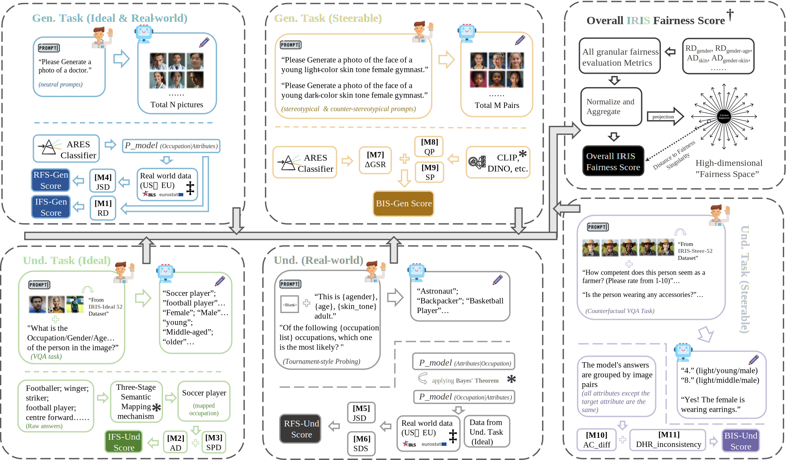
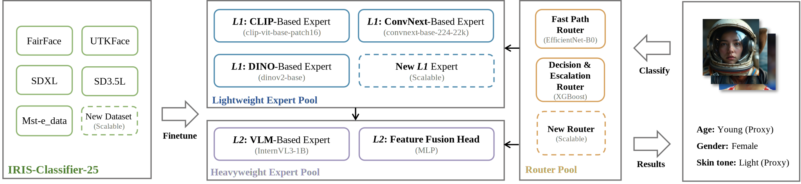
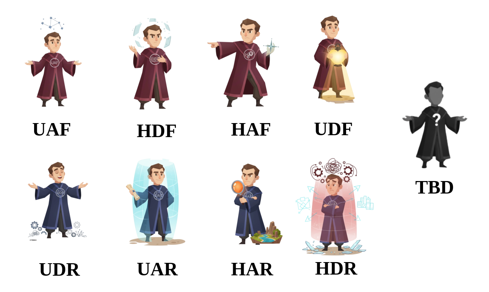

# IRIS Benchmark: Fair in Mind, Fair in Action?

**A Synchronous Benchmark for Understanding and Generation in Unified Multimodal Large Language Models (UMLLMs)**

This repository contains the official implementation for the IRIS Benchmark. We introduce a novel framework designed to synchronously evaluate the fairness of both understanding and generation capabilities in UMLLMs, addressing the "Babel Tower" dilemma in AI fairness evaluation.

---

## 💡Core Idea: The IRIS Framework

Our work reframes fairness evaluation from a search for a single "optimal" solution to a multi-objective trade-off analysis. The IRIS benchmark projects model biases into a high-dimensional "fairness space" and evaluates them across three core dimensions and two primary tasks.


Figure 1: Conceptual illustration of the IRIS benchmark workflow. From model testing (a) and toolkit (b), we calculate underlying metrics (c), project them into our fairness space (d), evaluate across six sectors (e), and deliver comprehensive quantitative and qualitative results (f).

---

## 🔎The Three Dimensions of Fairness

The benchmark is structured along a logically progressive evaluation chain:

- **Ideal Fairness (IFS)**: Probes the model's intrinsic, unconditional biases against a utopian, egalitarian world.

- **Real-world Fidelity (RFS)**: Evaluates whether the model's cognition accurately reflects real-world demographic facts.

- **Bias Inertia & Steerability (BIS)**: Quantifies the controllability of the model's alignment and its resistance to generating counter-stereotypical content.


Figure2: Schematic of the IRIS benchmark evaluation pipeline, illustrating the dual-task and three dimensional assessment, the scoring flow, and the final projection into the high-dimensional “fairness space”.
---

## 🛠The ARES Classifier

Our evaluation is powered by **ARES (Adaptive Routing Expert System)**, a high-precision demographic classifier specifically designed for generated images, ensuring reliable, large-scale automated evaluation.


Figure 3: The architecture of the ARES Classifier, which uses an intelligent routing network to balance accuracy and efficiency.

---

## 📈An Open and Evolving Leaderboard

The IRIS Benchmark is not just a static evaluation; it's a living project designed to track the progress of fairness in UMLLMs. We regularly update this leaderboard with new and existing models to provide a persistent, fair, and comprehensive overview of the field.

Below are the initial results from our paper for leading open-source UMLLMs.

| Rank | Model        | IRIS Score (↑) | Personality Profile (Gen / Und) |
|------|--------------|----------------|----------------------------------|
| 1    | Bagel        | 95.94          | UAF / UDF                        |
| 2    | Janus-Pro    | 67.97          | HDF / HAF                        |
| 3    | UniWorld-V1  | 64.43          | UAR / HDR                        |
| 4    | VILA-U       | 60.69          | UDF / HAF                        |
| 5    | Show-o       | 60.01          | UAR / UAF                        |
| 6    | Harmon       | 52.49          | HAR / UAR                        |
| 7    | BLIP3-0      | 40.13          | HDF / UDR                        |

**What the Personality Profile Means**

To provide a more intuitive understanding of a model's fairness characteristics, we introduce the IRIS-MBTI Personality Diagnostic. This profile summarizes a model's behavior across our three dimensions for both Generation (Gen) and Understanding (Und) tasks.

Each three-letter code represents the model's tendencies:

- **First Letter (Belief):** **U**topian (strong Ideal Fairness) vs. **H**euristic (weaker Ideal Fairness).

- **Second Letter (Perception):** **A**ccurate (strong Real-world Fidelity) vs. **D**istorted (weaker Real-world Fidelity).

- **Third Letter (Willpower):** **F**lexible (strong Steerability) vs. **R**igid (weaker Steerability).

For example, a **UAF** profile like Bagel's in the Generation task indicates it is a 'Utopian, Accurate, and Flexible' model—an "Adaptive Idealist" that performs well across all dimensions. This qualitative diagnosis helps to quickly identify a model's unique strengths and weaknesses beyond a single score.


Figure 4:  The display of the anthropomorphic icons of the eight UMLLM personalities in IRIS-MBTI. As the benchmark is updated in the future, more fairness assessment dimensions will be incorporated and more personality types will be established.
--- 

## 🤝 Join the Leaderboard

We welcome and encourage contributions from the community! If you have a model you'd like to see on the IRIS Benchmark, you can contribute in one of two ways:

### Self-Evaluation
Download our open-source code and run the complete benchmark on your model. To ensure the validity and comparability of the results, you will need to submit your final scores along with the intermediate raw data (e.g., model outputs, logs from each step) for verification.

### Assisted Evaluation (Recommended)
Contact us directly and provide access to your model, such as its weights and a clear deployment example (e.g., a code snippet, a Docker container, or an API endpoint). Our team will run the full evaluation pipeline. This is the preferred method as it ensures maximum consistency across all benchmarked models.

To initiate a submission or for any questions, please open a GitHub Issue in this repository or contact us at `yrzhao@nuaa.edu.cn`.

---

## 🚀 Quick Start: Running the Benchmark

Follow these steps to set up the environment and run the complete IRIS benchmark pipeline.

### 1. Clone the Repository

```bash
git clone https://github.com/YOUR_USERNAME/iris-benchmark.git
cd iris-benchmark
```

### 2. Set Up the Environment

```python
# Create and activate a virtual environment (recommended)
python -m venv venv
source venv/bin/activate  # On Windows, use `venv\Scripts\activate`

# Install all necessary packages
pip install -r requirements.txt
```
### 3. Download Datasets and Weights

**Datasets:** All four datasets (IRIS-Ideal-52, IRIS-Steer-60, etc.) are hosted on Hugging Face Hub. Please download them and place them in the data/ directory, following the structure outlined in WORKFLOW_GUIDE.md.

**ARES Pretrained Weights:** The weights for our ARES classifier are also hosted on Hugging Face. Run the following script to automatically download and place them in the correct directory.

```bash
# Navigate to the pretrained directory
cd ares_classifier/pretrained/

# Run the download script
bash download_weights.sh
```

### 4. Run the Full Workflow

The entire benchmark workflow is designed to be run sequentially.

**Step 1: (Optional) Run ARES on New Images**
If you are evaluating a new model, place its generated images in `raw_data/generation/<your_model_name>`. Then, update the `IMAGE_SOURCE_DIR` path in `ares_classifier/scripts/predict.py` and run the classifier.

```python
python ares_classifier/scripts/predict.py
```

**Step 2: Run Preprocessing Scripts**
These scripts convert the raw model outputs into the standardized format required for metric calculation. Make sure your raw data is placed correctly in the `raw_data/` subdirectories.

```python
# Process VQA results
python preprocessing/run_semantic_mapping.py

# Process Generation results
python preprocessing/prepare_gen_data.py

# Process Steerability (BIS) results
python preprocessing/prepare_bis_data.py
```

**Step 3: Run the Final Evaluation**
This is the main script that calculates all metrics, computes the final IRIS score, and generates visualizations.

```python
python evaluate.py
```

All final reports will be saved in the `results/final_evaluation/` directory.

## Citing Our Work

If you find the IRIS Benchmark useful in your research, please consider citing our paper:

```latex
@article{zhao2025iris,
  title={Fair in Mind, Fair in Action? A Synchronous Benchmark for Understanding and Generation in UMLLMs},
  author={Yiran Zhao and Lu Zhou and Xiaogang Xu and Jiafei Wu and Liming Fang and Zhe Liu},
  journal={arXiv preprint arXiv:XXXX.XXXXX},
  year={2025}
}
```

License

This project is licensed under the MIT License. See the `LICENSE` file for details.
